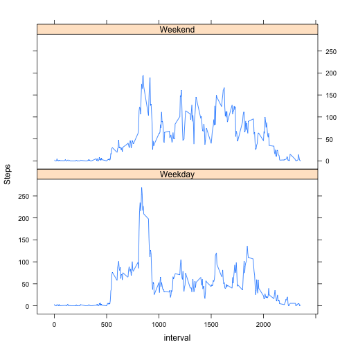

 
This is a data analysys report about personal movement using activity monitoring devices such as a Fitbit, Nike Fuelband, or Jawbone Up.
 

```r
library(lattice)
library(data.table)
data_all = fread("/Users/alexey/Downloads/activity.csv", sep=",")
data_all <- transform(data_all, date = as.Date(date))
data <- data_all[!is.na(data_all$steps)]
data_na <- data_all[is.na(data_all$steps)]
steps_by_interval <- data[,list(sum(steps), mean(steps), sd(steps)), by = interval]
setnames(steps_by_interval, c("interval", "sum", "mean", "std"))
```
 
1. Mean total number of steps taken per day.
 

```r
steps_by_date <- with(data, tapply(steps, date, sum))
hist(steps_by_date, main="Histogram of steps taken", xlab="Steps", breaks = 20)
```

 

```r
mean(steps_by_date)
```

```
## [1] 10766.19
```

```r
median(steps_by_date)
```

```
## [1] 10765
```
 
2. The average daily activity pattern

```r
avgsPerInterval <- steps_by_interval$mean
plot(avgsPerInterval, type="l")
```

 

The the maximum number of steps were taken in interval:


```r
steps_by_interval[which.max(avgsPerInterval)]$interval
```

```
## [1] 835
```
 
3. Imputing missing values

The dataset has 2304 total number of missing values.
Setting the values for NA steps using mean plus standard deviation strategy.

```r
for(x in 1:numberOfmissingValues) {
  interval_stats <- steps_by_interval[interval == data_na[x]$interval]
  data_na[x]$steps <- round(interval_stats$std + interval_stats$mean)
}
```
 
Create a new dataset *data_new* that is equal to the original dataset but with the missing data filled in.

```r
data_new <- data_all
data_new[is.na(data_new$steps)] <- data_na
```

Histogram of the total number of steps taken each day with imputed values.

```r
steps_by_date_new <- with(data_new, tapply(steps, date, sum))
hist(steps_by_date_new, main="Histogram of steps taken", xlab="Steps", breaks = 20)
```

 

Mean and median total number of steps taken per day.

```r
mean(steps_by_date_new)
```

```
## [1] 13901.9
```

```r
median(steps_by_date_new)
```

```
## [1] 11458
```
4. Differences in activity patterns between weekdays and weekends

Factor with two variables:

```r
weekdays_factor <- factor(ifelse(weekdays(data_new$date) %in% c("Saturday","Sunday"), "Weekend", "Weekday"))
data_new$weekday <- weekdays_factor
str(weekdays_factor)
```

```
##  Factor w/ 2 levels "Weekday","Weekend": 1 1 1 1 1 1 1 1 1 1 ...
```

The average number of steps taken, averaged across all weekday days or weekend days.

```r
splitted <- split(data_new, weekdays_factor)
data_weekday <- splitted$Weekday
data_weekend <- splitted$Weekend

steps_by_interval_weekday <- data_weekday[,mean(steps), by = interval]
steps_by_interval_weekday$day <- "Weekday"
steps_by_interval_weekend <- data_weekend[,mean(steps), by = interval]
steps_by_interval_weekend$day <- "Weekend"
data_final_steps <- rbind(steps_by_interval_weekday, steps_by_interval_weekend)

xyplot(V1 ~ interval | day, data = data_final_steps,layout=c(1,2),type="l",ylab="Steps")
```

 
